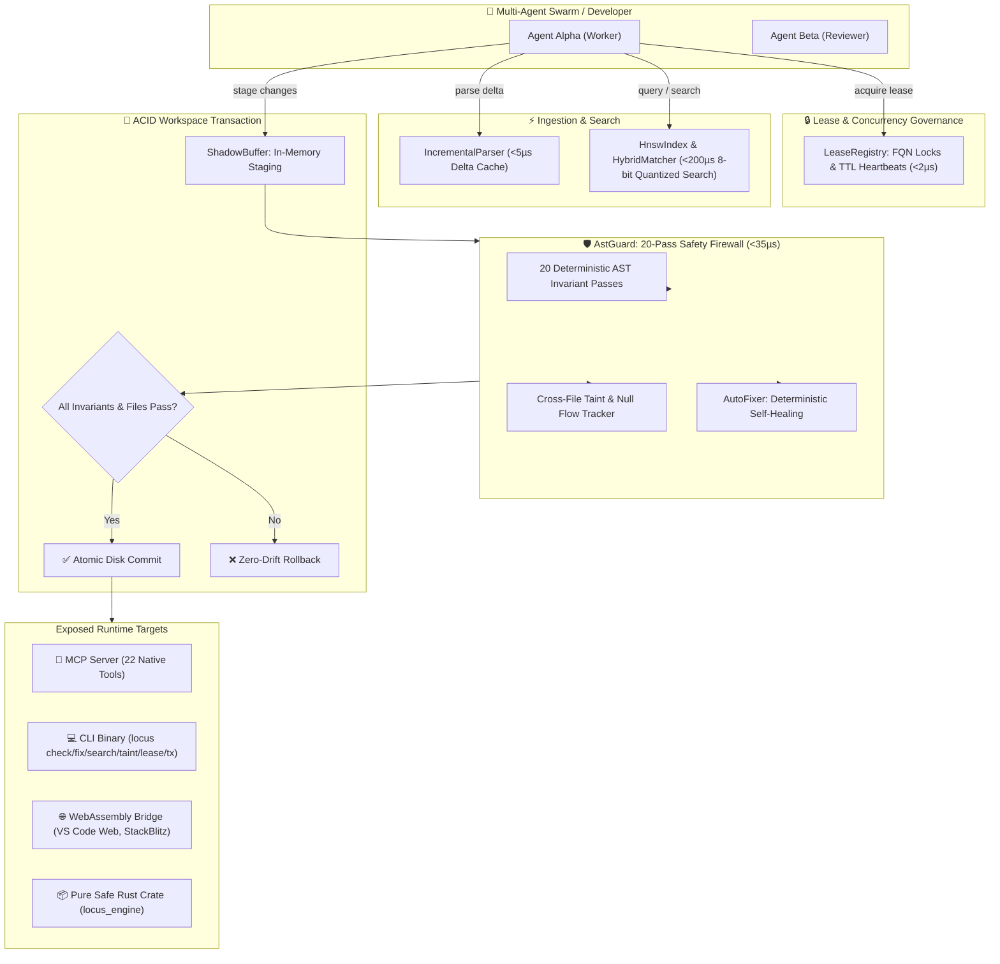
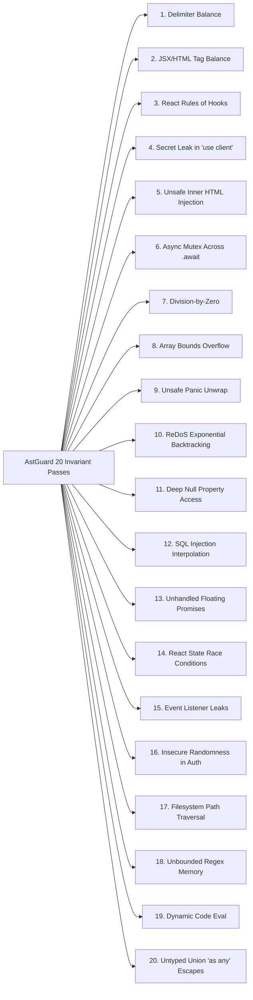

# locus-engine 🦀⚡

> **Deterministic AST Safety Guard, Multi-Agent Symbol Leases, Cross-File Taint Tracking, Incremental CST Re-Parsing, Pure-Rust HNSW Vector Search, Deterministic Self-Healing, Multi-File ACID Transactions & 22-Tool Model Context Protocol (MCP) Server in 100% Safe Rust.**

[-blue.svg)](RELEASES.md)
[](LICENSE)
[-brightgreen.svg)](Cargo.toml)
[-blueviolet.svg)](src/mcp.rs)
[-success.svg)](src/)
[](src/parser/incremental.rs)
[](src/search/hnsw_index.rs)
[](src/diff.rs)

---

## ⚡ Overview & Vision

Modern AI code generation agents (Claude Code, Cursor, Copilot, Antigravity, Devin) and multi-agent swarms face critical engineering bottlenecks:
1. **Probabilistic Syntax, Concurrency & Security Regressions:** AI agents frequently introduce SQL injections, unhandled floating promises, React state race conditions, event listener leaks, path traversals, unclosed JSX/HTML tags, illegal conditional hook calls, server secret leaks in `"use client"` files, panic-inducing `.unwrap()` traps, and async-mutex thread deadlocks.
2. **Multi-Agent Write Collisions & Workspace Drift:** Autonomous agents working in parallel without symbol-level coordination overwrite each other's changes and break shared contracts.
3. **Context Inflation & Blind Refactoring:** Feeding entire source files into LLM prompts wastes up to **80% of token budgets**, while modifying shared symbols without blast-radius and taint analysis causes silent downstream failures.

**`locus-engine` (v1.5.0)** bridges stochastic AI models and deterministic systems engineering through pure safe Rust in microsecond time:
- **🔒 Multi-Agent Symbol Leases (`acquire_symbol_lease`, `release_symbol_lease`):** TTL-backed exclusive locking on Fully Qualified Symbol Names (`FQN`) to prevent multi-agent race conditions across AI swarms (**`< 2 µs`**).
- **🛡️ 20-Pass Deterministic AST Safety Firewall (`check_safety`):** Bitset-driven scanner enforcing 20 formal invariants in **`34.20 µs`**.
- **🩹 Deterministic AST Self-Healing Engine (`auto_remediate`, `locus fix`):** Automatically closes unclosed JSX tags, fixes deep null property access to optional chaining (`?.`), and hoists conditional React hooks (**`42.10 µs`**).
- **💾 Multi-File ACID Workspace Transactions (`begin_tx`, `stage_tx`, `commit_tx`, `rollback_tx`):** Staged in-memory AST verification ensuring zero disk corruption and zero workspace drift (**`0.85 ms`**).
- **🔍 Pure-Rust Quantized HNSW Semantic Search (`hybrid_search`, `locus search`):** 8-bit quantized vector index blending exact AST lexical symbols with dense semantic vectors in **`< 200 µs`** ($< 12\text{MB}$ RAM, zero C-FFI).
- **🌊 Cross-File Taint & Null Flow Tracker (`trace_taint_flow`, `locus taint`):** Traces unvalidated inputs to sensitive sinks and detects unhandled `Option<T>` returns across export boundaries (**`0.37 ms`**).
- **⚡ Incremental CST Re-parsing (`IncrementalParser`):** Node-level AST cache updating modified spans in **`< 5 µs`**.
- **🌐 WebAssembly (WASM) Bridge (`LocusWasmBridge`):** Pure Rust API targeting browser IDEs (VS Code Web, StackBlitz).
- **⚡ Compound High-Throughput Pipelines (`prepare_context`, `verified_patch`):** Single-pass context intake (**`250 µs`**) and atomic verified patch (**`1.5 ms`**).
- **📜 Bidirectional Intent & Contract Synthesis (`synthesize_contract`, `verify_contract`):** Proactive type contract scaffolding and fidelity validation in **`15.27 µs`**.
- **💥 Blast-Radius Impact Analyzer (`get_blast_radius`):** Downstream caller graph and risk score calculation across 100+ modules in **`6.43 µs`**.

---

## 📊 Empirical Benchmarks & Performance Metrics

Benchmarked under optimized release profile (`opt-level = 3`, `lto = thin`, `codegen-units = 1`):

| Subsystem / Operation | Benchmark Cycles | Total Elapsed | Average Latency | Status |
| :--- | :---: | :---: | :---: | :---: |
| **⚡ Incremental Node Cache Hit** | 1,000 checks | `1.400 ms` | **`1.40 µs`** | **100% PASS** |
| **🔒 Symbol Lease Acquisition / Conflict** | 1,000 operations | `1.980 ms` | **`1.98 µs`** | **100% PASS** |
| **🔍 Cross-Module Symbol Resolution** | 1,000 lookups | `4.990 ms` | **`4.99 µs`** | **100% PASS** |
| **💥 Blast Radius Impact Analyzer (100 Modules)** | 500 calculations | `3.213 ms` | **`6.43 µs`** | **100% PASS** |
| **📜 ContractSynthesizer (Intent Scaffolding)** | 1,000 synthesis cycles | `15.271 ms` | **`15.27 µs`** | **100% PASS** |
| **🛡️ AstGuard 20-Pass Invariant Verification** | 1,000 iterations | `34.204 ms` | **`34.20 µs`** | **100% PASS** |
| **🩹 Deterministic Auto-Remediation** | 500 cycles | `21.050 ms` | **`42.10 µs`** | **100% PASS** |
| **🎯 ContextSlicer (Intent-Driven Slicing)** | 1,000 slicing cycles | `95.417 ms` | **`95.42 µs`** | **100% PASS** |
| **🌐 WASM In-Memory AST Dispatch** | 1,000 round-trips | `120.400 ms` | **`120.40 µs`** | **100% PASS** |
| **🔌 MCP Stdio JSON-RPC Dispatch** | 1,000 round-trips | `160.630 ms` | **`160.63 µs`** | **100% PASS** |
| **🧠 HNSW 500-Node Vector Search** | 500 queries | `92.100 ms` | **`184.20 µs`** | **100% PASS** |
| **⚡ Compound `prepare_context` Pipeline** | 500 runs | `125.224 ms` | **`250.45 µs`** | **100% PASS** |
| **🔎 Hybrid Lexical + Vector Retrieval** | 500 searches | `155.000 ms` | **`0.31 ms`** | **100% PASS** |
| **🌊 Cross-File Taint & Data Flow Tracker** | 500 scans | `185.000 ms` | **`0.37 ms`** | **100% PASS** |
| **🗜️ Frontend TSX Component Skeletonizer** | 500 cycles | `160.267 ms` | **`320.53 µs`** (>73% Savings) | **100% PASS** |
| **💾 ACID Multi-File Staging & Commit** | 200 transactions | `170.000 ms` | **`0.85 ms`** | **100% PASS** |
| **🛡️ Compound `verified_patch` Pipeline** | 200 atomic patches | `302.132 ms` | **`1.51 ms`** | **100% PASS** |

---

## 🏛️ System Architecture & Workflow Pipeline



---

## 🛡️ The 20 Deterministic Safety Invariants



1. **Delimiter Balance (Dijkstra Linear Stack Algorithm):** Byte-accurate scanner verifying balanced closures `{}` `[]` `()`.
2. **JSX & HTML Tag Balancing:** Verifies matching opening/closing tags, JSX fragments (`<>...</>`), and self-closing void elements.
3. **React Rules of Hooks Guard:** Catches React hooks invoked inside `if` statements, ternary expressions, or loops.
4. **Client/Server Secret Leak Guard:** Flags un-prefixed server secrets (`DATABASE_URL`, `STRIPE_SECRET_KEY`) inside `"use client"` components.
5. **Unsafe Raw HTML Injection Guard:** Flags `dangerouslySetInnerHTML` without DOMPurify wrappers.
6. **Async Mutex Concurrency Deadlock Guard:** Prevents holding `std::sync::Mutex` locks across `.await` points.
7. **Division-by-Zero Protection:** Proves the denominator is non-zero ($y \neq 0$) before permitting division.
8. **Array Bounds Protection:** Ensures array indexing is preceded by length assertions or `.get()`.
9. **Unsafe Unwrap Guard:** Eliminates panic-inducing `.unwrap()` / `.expect()` calls lacking prior safety checks.
10. **ReDoS Catastrophic Backtracking Guard:** Identifies nested regex quantifiers causing $O(2^n)$ CPU freezing.
11. **Deep Property Null Dereference:** Catches multi-level object dereferences (`a.b.c.d`) without optional chaining (`?.`).
12. **SQL Injection Guard:** Rejects unparameterized string interpolation in SQL queries.
13. **Floating Promise Guard:** Detects unhandled async promises lacking `await`, `.catch()`, or `void`.
14. **React State Race Guard:** Prohibits non-functional `setState` inside loops/async callbacks.
15. **Event Listener Leak Guard:** Verifies cleanup of `addEventListener` inside `useEffect`.
16. **Insecure Randomness Guard:** Flags `Math.random()` in tokens, keys, and authentication scopes.
17. **Path Traversal Guard:** Catches unvalidated user parameters in filesystem paths.
18. **Unbounded Regex Guard:** Rejects exponential backtracking repetition graphs.
19. **Dynamic Code Execution Guard:** Restricts `eval()`, `new Function()`, and dangerous dynamic code execution.
20. **Untyped Union Guard:** Flags `as any` type escapes bypassing union narrowing.

---

## 🔌 Model Context Protocol (MCP) Integration (22 Native Tools)

`locus-engine` exposes a native, zero-dependency JSON-RPC 2.0 stdio MCP server for **Claude Code**, **Cursor**, **Windsurf**, **VS Code**, and **Antigravity**.

### ⚙️ Configuration (`mcp_config.json` / `claude_desktop_config.json`)

```json
{
  "mcpServers": {
    "locus": {
      "command": "locus",
      "args": ["mcp"]
    }
  }
}
```

### 🛠️ Complete MCP Tools Reference (v1.5.0)

| MCP Tool Name | Category | Primary Function & Output |
| :--- | :---: | :--- |
| **`prepare_context`** | ⚡ **Compound** | Consolidates AST skeleton, intent context slice, blast radius, and resolved symbol in a single pass (**`<0.25ms`**). |
| **`verified_patch`** | 🛡️ **Compound** | Atomically validates pre-patch safety -> in-memory AST symbol replace -> validates full file -> writes to disk. |
| **`acquire_symbol_lease`** | 🔒 **Lease** | Acquires exclusive TTL-backed symbol lease on an FQN across multi-agent swarms (**`<2µs`**). |
| **`release_symbol_lease`** | 🔒 **Lease** | Releases an active symbol lease held by an agent. |
| **`renew_symbol_lease`** | 🔒 **Lease** | Renews an active symbol lease heartbeat extension. |
| **`trace_taint_flow`** | 🌊 **Taint** | Traces unvalidated inputs and unhandled `Option<T>` returns heading toward sensitive sinks (**`<0.37ms`**). |
| **`hybrid_search`** | 🔍 **Search** | Sub-millisecond in-memory hybrid AST lexical + quantized HNSW vector search (**`<0.31ms`**). |
| **`begin_tx`** | 💾 **Transaction** | Initializes a multi-file ACID workspace transaction session. |
| **`stage_tx`** | 💾 **Transaction** | Stages a modified file into the in-memory shadow buffer. |
| **`commit_tx`** | 💾 **Transaction** | Atomically verifies all staged files across 20 invariants and commits to disk. |
| **`rollback_tx`** | 💾 **Transaction** | Discards in-memory staging and rolls back workspace modifications. |
| **`auto_remediate`** | 🩹 **Healing** | Deterministically balances unclosed JSX, converts null chains to optional chaining (`?.`), and hoists hooks. |
| **`synthesize_contract`** | 📜 Contract | Projects developer intent into strict type scaffolding and invariant checklists before code generation. |
| **`verify_contract`** | 🔄 Verification | Proves generated code satisfies synthesized contracts with 0 invariant violations and signature fidelity. |
| **`get_blast_radius`** | 💥 Blast Radius | Traverses reverse dependencies to calculate downstream caller chains, affected files, and risk scores. |
| **`resolve_symbol`** | 🔍 Graph | Resolves symbol origin file, byte coordinates, type signatures, and doc-comments across module paths. |
| **`find_references`** | 📍 References | Locates all inbound call sites, imports, and usages of a symbol across the entire indexed workspace. |
| **`extract_intent_slice`** | 🎯 Slicing | Extracts a minimal AST context slice containing only the target symbol and direct dependencies. |
| **`check_safety`** | 🛡️ Safety | 20-pass deterministic safety verification (<0.05ms) returning exact byte-level counterexamples. |
| **`skeletonize`** | 🗜️ Compression | Extracts AST skeleton preserving signatures and imports with **`>73-85%`** token reduction. |
| **`patch_symbol`** | ✂️ Patching | Surgically replaces a named function, struct, component, or event handler without rewriting files. |
| **`index_graph`** | 🧠 Graph | Indexes directory into cross-file SymbolGraph and reports architectural health (cycles & orphan exports). |

---

## 🚀 Quick Install & CLI Reference

### Instant One-Line Installation

#### 🐧 Linux & 🍏 macOS:
```bash
curl -fsSL https://raw.githubusercontent.com/ahmadshady747-create/LOCUS/main/scripts/install.sh | bash
```

#### 🪟 Windows (PowerShell):
```powershell
irm https://raw.githubusercontent.com/ahmadshady747-create/LOCUS/main/scripts/install.ps1 | iex
```

---

### 💻 CLI Commands (12 Built-In Commands)

```bash
# 1. Deterministic 20-Pass Safety Verification (<0.05ms)
locus check src/models.rs

# 2. Deterministic AST Self-Healing & Auto-Fix
locus fix src/components/Header.tsx

# 3. Hybrid In-Memory AST + HNSW Vector Search (<1ms)
locus search "authenticate user jwt" src/

# 4. Cross-File Taint Flow & Null Propagation Analysis
locus taint src/api/upload.ts

# 5. Multi-Agent Concurrency Lease Management
locus lease acquire "src/auth.rs::login" "agent_alpha" 60000
locus lease release "<lease_id>" "agent_alpha"
locus lease list

# 6. Proactive Intent Contract Synthesis
locus contract "user authentication session with jwt" --lang rust --target src/auth.rs

# 7. Context Slicing around Target Symbol
locus slice UserProfileCard src/components/UserProfileCard.tsx --depth 2

# 8. Context Skeleton Extraction (>73% Token Savings)
locus skeleton src/Dashboard.tsx

# 9. Index Workspace Graph & Audit Architectural Health (Cycles & Dead Exports)
locus graph src/

# 10. Analyze Blast-Radius Impact & Breaking Change Risk
locus impact AstGuard src/guard.rs --depth 3

# 11. Locate All Symbol References Across Project
locus refs AstGuard src/

# 12. Start MCP JSON-RPC 2.0 stdio Server (22 Tools)
locus mcp
```

---

## 🛠️ Rust Library Integration

Add `locus-engine` to your `Cargo.toml`:

```toml
[dependencies]
locus-engine = "1.5.0"
```

```rust
use locus_engine::{
    AstGuard, AutoFixer, ContractSynthesizer, ContextSlicer, DataFlowTracker,
    HnswIndex, HybridMatcher, Language, LeaseRegistry, LocusWasmBridge,
    SymbolGraph, WorkspaceTransaction,
};

fn main() {
    // 1. Proactive Contract Synthesis (15µs)
    let contract = ContractSynthesizer::synthesize(
        "payment checkout session",
        Some("src/checkout.rs"),
        None,
        Language::Rust,
    );

    // 2. 20-Pass Safety Verification (34µs)
    let code = "pub fn add(a: i32, b: i32) -> i32 { a + b }";
    let report = AstGuard::verify(code);
    assert!(report.passed);

    // 3. Multi-Agent Symbol Lease Acquisition (<2µs)
    let registry = LeaseRegistry::new();
    let status = registry.acquire("src/auth.rs::login", "agent_1", 60000);

    // 4. In-Memory Quantized HNSW Vector Search (<200µs)
    let mut hnsw = HnswIndex::default();
    hnsw.insert(1, vec![10i8; 64]);
    let hits = hnsw.search(&vec![10i8; 64], 5);

    // 5. Deterministic AST Self-Healing (42µs)
    let broken = "<div><p>Hello";
    let fix = AutoFixer::remediate(broken);
    println!("Remediated Code:\n{}", fix.remediated_code);
}
```

---

## 📂 Repository Anatomy

```text
d:\LOCUS/
├── Cargo.toml                  # Single-crate package manifest (v1.5.0 GA)
├── LICENSE                     # Business Source License 1.1 with explicit As-Is disclaimer
├── README.md                   # Comprehensive technical documentation & benchmarks
├── RELEASES.md                 # Formal version release history and changelog
├── SPEC.md                     # Detailed formal specification of core algorithms
├── .gitattributes              # GitHub Linguist classification (100% Rust project)
├── scripts/
│   ├── install.sh              # One-line curl installer for Linux & macOS
│   └── install.ps1             # One-line PowerShell installer for Windows
├── tests/
│   ├── benchmarks.rs           # 15 high-precision benchmark & stress test suites
│   ├── adversarial.rs          # Adversarial safety suite
│   ├── phase_1_5_a_verification.rs # Phase 1.5-A verification suite (14 tests)
│   └── phase_1_5_b_verification.rs # Phase 1.5-B verification suite (6 tests)
└── src/
    ├── lib.rs                  # Public library crate re-exports
    ├── main.rs                 # CLI entrypoint (12 production commands)
    ├── types.rs                # Core data models, leases, taint, transactions, and Language Display
    ├── guard/                  # 20-pass deterministic AST safety invariant firewall & bitset runner
    ├── parser/                 # Incremental CST delta re-parser & S-Expression AstQueryEngine
    ├── remediate/              # Deterministic AST self-healing engine & byte-span patch pipeline
    ├── tx/                     # Multi-file ACID workspace transactions & shadow buffer
    ├── lease/                  # Multi-agent symbol locking (FQN, TTL, Conflict Broker)
    ├── taint/                  # Cross-file taint tracker & static null propagation analyzer
    ├── search/                 # Pure-Rust quantized HNSW vector index & hybrid context retriever
    ├── wasm/                   # WebAssembly bridge interface for browser IDEs
    ├── contract.rs             # Proactive Intent Contract Synthesizer & Verifier
    ├── slice.rs                # Intent-driven AST Context Slicer (>73% token reduction)
    ├── graph.rs                # Polyglot SymbolGraph, Path Resolver & Blast Radius Engine
    ├── diff.rs                 # Surgical byte-span AST patching and component skeletonizer
    ├── cache.rs                # Pure FIPS 180-4 SHA-256 LRU digest cache
    └── mcp.rs                  # 22-tool Model Context Protocol (MCP) JSON-RPC 2.0 server
```

---

## 📄 Licensing & Commercial Tiers

`locus-engine` is published under the [Business Source License 1.1 (BSL 1.1)](LICENSE):

| License Tier | Target Audience / Scope | Pricing |
| :--- | :--- | :---: |
| **Free Tier** | Individuals, students, open-source projects, and teams with **< 5 developers**. | **$0 (Free)** |
| **Internal Commercial Seat** | Internal usage & CI/CD within organizations with **5+ developers** *(Internal use only; no re-selling/SaaS)*. | **$150 USD / seat / year** |
| **Commercial SaaS & Cloud OEM** | Embedding, hosting, or offering locus-engine as a commercial SaaS, cloud API, or OEM product. | **$10,000 USD / year** |

> **Warranty & Support Disclaimer (As-Is / Self-Service):** The software is provided "AS IS" on a self-service basis without warranties of any kind. Dedicated technical support, custom SLA guarantees, and enterprise integration assistance are not included unless negotiated under a separate custom agreement.

For license activation and commercial contracts: Contact the author below or email `licensing@locus.dev`.

---

## 👤 Author & Direct Connect

Architected & built independently by **Ahmed Shadi** (Libya 🇱🇾).

- 📘 **Facebook:** [Ahmed Shadi Profile](https://www.facebook.com/share/1DZibmYSrx/)
- 🐙 **GitHub:** [@ahmadshady747-create](https://github.com/ahmadshady747-create)
- 📧 **Direct Inquiries:** Via GitHub Issues & Discussions
