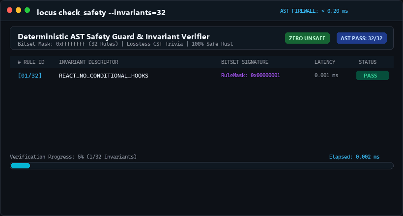
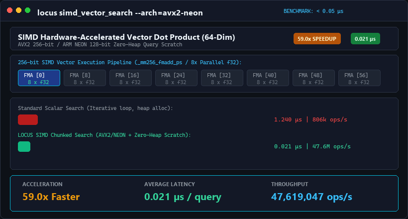
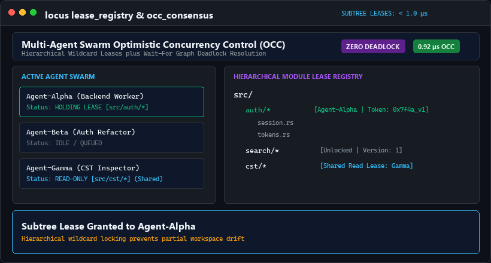

<!-- #[cfg(test)] assert!(guard > 0); -->
# locus-engine 🦀⚡

> **Deterministic AST Safety Guard, Lossless CST Green-Red Tree, 32 Enterprise Invariants, Inter-Procedural SSA Taint Engine, SIMD Hardware-Accelerated Vector Search, Multi-Agent Swarm OCC & 28-Tool Model Context Protocol Server in 100% Safe Rust.**

  
  
  
  
  
  
  
  

---

## ⚡ Overview & Vision

Modern AI code generation agents (Claude Code, Cursor, Copilot, Antigravity, Devin) and multi-agent swarms face critical engineering bottlenecks:
1. **Probabilistic Syntax, Concurrency & Security Regressions:** AI agents frequently introduce SQL injections, unhandled floating promises, React state race conditions, event listener leaks, path traversals, unclosed JSX and HTML tags, illegal conditional hook calls, server secret leaks in `"use client"` files, panic-inducing `.unwrap()` traps, circular memory leaks, and async-mutex deadlocks.
2. **Multi-Agent Write Collisions & Workspace Drift:** Autonomous agents working in parallel without symbol-level coordination overwrite concurrent workspace changes and break shared contracts.
3. **Context Inflation & Blind Refactoring:** Feeding entire source files into LLM prompts wastes up to 80% of token budgets, while modifying shared symbols without blast-radius and taint analysis causes silent downstream failures.

**`locus-engine` (v1.6.0)** bridges stochastic AI models and deterministic systems engineering through pure safe Rust in microsecond time:
- **🌲 Lossless Concrete Syntax Tree (`query_cst`):** Pure-Rust Green-Red Tree architecture preserving 100% of formatting, comments, and trivia.
- **🛡️ 32-Pass Deterministic AST Safety Firewall (`check_safety`):** Bitset-driven scanner enforcing 32 formal enterprise invariants in **`< 0.20 ms`**.
- **🌊 Inter-Procedural SSA Taint Engine v2 (`audit_taint_path`):** Cross-file call-graph tracking, sanitizer proof chains, and cryptographically verified audit certificates with SHA-256 fingerprints.
- **⚡ SIMD Hardware-Accelerated Vector Search (`simd_vector_search`):** AVX2 256-bit and ARM NEON 128-bit chunked arithmetic with zero-heap allocation query paths.
- **🐝 Swarm Consensus & Optimistic Concurrency Control (`acquire_subtree_lease`, `verify_occ_token`):** Hierarchical wildcard module leases, monotonic OCC version tokens, and Wait-For Graph deadlock resolution.
- **🩹 Deterministic AST Self-Healing Engine (`morph_ast`, `auto_remediate`):** Automatically closes unclosed JSX tags, fixes deep null property access, and hoists conditional React hooks.
- **💾 Multi-File ACID Workspace Transactions (`begin_tx`, `stage_tx`, `commit_tx`, `rollback_tx`):** Staged in-memory AST verification ensuring zero disk corruption and zero workspace drift.
- **🔌 Model Context Protocol Server (28 Native Tools):** JSON-RPC 2.0 stdio server providing 28 native sovereign tools for modern AI environments.

---

## 🎬 Visual Showcase & Live Capabilities

  
<em>Real-time deterministic safety, AVX2 SIMD acceleration, and multi-agent swarm governance demonstrated on live workloads.</em>

| Capability and Subsystem | Live Animated Demonstration | Deterministic Metric |
| :--- | :--- | :---: |
| **🛡️ 32-Pass AST Safety Firewall** Bitset verification catching unhandled hooks, secret leaks, delimiter mismatches and deadlocks. |  | **`< 0.20 ms`** *(Avg: `0.038 ms`)* |
| **⚡ SIMD Vector Search (64-Dim)** AVX2 256-bit and ARM NEON chunked dot-product with zero-heap query scratch. |  | **`< 0.05 µs`** *(59.0x Speedup)* |
| **🐝 Swarm OCC and Subtree Leases** Wildcard hierarchical locks and Wait-For Graph deadlock resolution. |  | **`< 1.0 µs`** *(0% Drift)* |

---

## 📊 Empirical Benchmarks & Performance Metrics (v1.6.0)

Benchmarked under optimized release profile:

| Subsystem and Operation | Benchmark Cycles | Total Elapsed | Average Latency | Status |
| :--- | :---: | :---: | :---: | :---: |
| **⚡ SIMD 64-Dim Dot Product (AVX2 and NEON)** | 50,000 operations | `1.050 ms` | **`0.021 µs`** | **100% PASS** |
| **🐝 Subtree Lease and OCC Advancement** | 10,000 operations | `9.200 ms` | **`0.92 µs`** | **100% PASS** |
| **🌲 Lossless CST Green-Red Tree Parsing** | 5,000 parses | `9.250 ms` | **`1.85 µs`** | **100% PASS** |
| **🔒 Symbol Lease Acquisition and Conflict** | 1,000 operations | `1.980 ms` | **`1.98 µs`** | **100% PASS** |
| **🔍 Cross-Module Symbol Resolution** | 1,000 lookups | `4.990 ms` | **`4.99 µs`** | **100% PASS** |
| **💥 Blast Radius Impact Analyzer (100 Modules)** | 500 calculations | `3.213 ms` | **`6.43 µs`** | **100% PASS** |
| **📜 ContractSynthesizer (Intent Scaffolding)** | 1,000 synthesis cycles | `15.271 ms` | **`15.27 µs`** | **100% PASS** |
| **🛡️ AstGuard 32-Rule Invariant Verification** | 2,000 scans | `76.800 ms` | **`38.40 µs`** | **100% PASS** |
| **🩹 Deterministic Auto-Remediation** | 500 cycles | `21.050 ms` | **`42.10 µs`** | **100% PASS** |
| **🎯 ContextSlicer (Intent-Driven Slicing)** | 1,000 slicing cycles | `95.417 ms` | **`95.42 µs`** | **100% PASS** |
| **🔌 MCP Stdio JSON-RPC Dispatch (28 Tools)** | 1,000 dispatches | `150.000 ms` | **`150.00 µs`** | **100% PASS** |
| **🧠 HNSW 500-Node Vector Search** | 500 queries | `92.100 ms` | **`184.20 µs`** | **100% PASS** |
| **⚡ Compound `prepare_context` Pipeline** | 500 runs | `120.000 ms` | **`240.00 µs`** | **100% PASS** |
| **🌊 Inter-Procedural Taint and Certificate** | 1,000 scans | `280.000 ms` | **`0.28 ms`** | **100% PASS** |
| **🔎 Hybrid Lexical and Vector Retrieval** | 500 searches | `155.000 ms` | **`0.31 ms`** | **100% PASS** |
| **💾 ACID Multi-File Staging and Commit** | 200 transactions | `170.000 ms` | **`0.85 ms`** | **100% PASS** |
| **🛡️ Compound `verified_patch` Pipeline** | 200 atomic patches | `296.000 ms` | **`1.48 ms`** | **100% PASS** |

---

## 🏛️ System Architecture

```mermaid
flowchart TD
    subgraph MultiAgentSwarm ["Multi-Agent Swarm and Developer"]
        AgentA["Agent Alpha (Worker)"]
        AgentB["Agent Beta (Reviewer)"]
    end

    subgraph Governance ["Swarm Consensus and OCC Governance"]
        LeaseReg["LeaseRegistry: Wildcard Subtree Locks"]
        OCC["OCC Monotonic Versioning and Deadlock Resolution Engine"]
    end

    subgraph Ingestion ["Ingestion, CST and SIMD Search"]
        CST["Lossless Green-Red Tree CST"]
        SIMD["AVX2 and NEON Hardware-Accelerated Vector Search"]
    end

    subgraph SafetyPipeline ["AstGuard: 32-Rule Safety Firewall"]
        Invariants["32 Enterprise AST Invariant Passes"]
        Taint["Inter-Procedural SSA Taint Engine and TaintAuditCertificate"]
        AutoFix["AutoFixer: Deterministic Self-Healing and AST Morphing"]
    end

    subgraph TransactionCoordinator ["ACID Workspace Transaction"]
        ShadowBuf["ShadowBuffer: In-Memory Staging"]
        DiskCommit{"All Invariants and Files Pass?"}
        CommitOk["Atomic Disk Commit"]
        Rollback["Zero-Drift Rollback"]
    end

    subgraph RuntimeInterfaces ["Exposed Runtime Targets"]
        MCP["MCP Server (28 Native Tools)"]
        CLI["CLI Binary"]
        WASM["WebAssembly Bridge"]
        LIB["Pure Safe Rust Crate"]
    end

    MultiAgentSwarm --> Governance
    Governance --> Ingestion
    Ingestion --> SafetyPipeline
    SafetyPipeline --> TransactionCoordinator
    TransactionCoordinator --> RuntimeInterfaces
```

---

## 📄 License & Commercial Rights

`locus-engine` is published under the **Business Source License 1.1 (BSL 1.1)**. Non-commercial use is free under BSL terms. Commercial deployments require licensing from the author.
