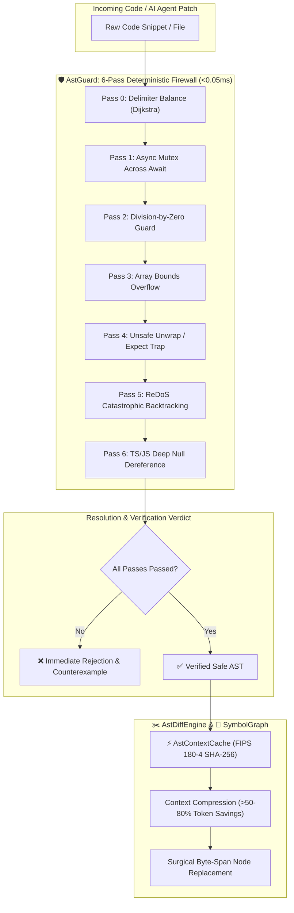

# locus-engine 🦀⚡

> **Deterministic AST Safety Guard, Polyglot Semantic Symbol Graph, and Surgical Byte-Span Patching Engine in Pure Rust.**

[](LICENSE)
[](Cargo.toml)
[](src/)
[](src/guard.rs)
[](src/cache.rs)

---

## ⚡ Overview & Vision

Modern AI code generation agents and automated pipelines face two systemic engineering bottlenecks:
1. **Probabilistic Syntax & Concurrency Regressions:** AI agents frequently hallucinate unclosed delimiters, dangerous unwrap traps, async-mutex deadlocks, catastrophic regexes (ReDoS), and unbounded array access.
2. **Context Window Inflation:** Passing full source files repeatedly into LLM contexts wastes up to 80% of token budgets.

**`locus-engine`** solves both challenges as a **standalone, zero-bloat, high-performance systems engine** written in 100% safe Rust. It enforces deterministic, non-negotiable safety invariants in microseconds and extracts cross-file symbol graphs with minimal context footprints.

---

## 📊 Empirical Benchmarks & Comparison

| Metric / Capability | **`locus-engine`** | Traditional Linters / SAST | Cloud AI Guardrails |
| :--- | :---: | :---: | :---: |
| **Verification Latency** | **`< 0.05 ms` (Sub-millisecond)** | 200 – 1,500 ms | 400 – 2,000 ms (Cloud Round-Trip) |
| **Execution Architecture** | **In-Memory Pure Rust Kernel** | Process Spawns / Node.js | Network HTTP REST API |
| **Context Token Savings** | **`> 50% - 80%` (AST Skeleton)** | 0% (Full Files) | 0% (Full Files) |
| **Memory Safety** | **100% Safe Rust (0 Unsafe Blocks)** | Varies (C/C++/Node) | Undefined |
| **External Dependencies** | **Zero Crypto/Runtime Bloat** | Heavy `node_modules` / Python env | Cloud Connection & API Keys |
| **Deterministic Guarantee** | **100% Strict Formal Rejection** | Heuristic Warnings | Probabilistic LLM Re-evaluation |

---

## 🏛️ System Architecture & Workflow Pipeline



---

## 🏛️ Core Architectural Pillars

- **🛡️ AstGuard:** 6-Pass Deterministic Safety Invariants (<0.05ms) covering delimiter balance, async mutex across await, division-by-zero, array bounds, unsafe unwraps, ReDoS, and deep null dereference.
- **🧠 SymbolGraph:** Polyglot AST symbol indexer and cross-file dependency graph across Rust, TypeScript, JavaScript, and Python.
- **⚡ AstContextCache:** High-speed in-memory LRU cache keyed by pure Rust FIPS 180-4 standard SHA-256 (Zero external crypto dependencies).
- **✂️ AstDiffEngine:** Surgical byte-span AST patching and structural skeletonization for context compression (>50-80% token savings).

---

## 🛡️ The 6 Deterministic Safety Invariants

```mermaid
graph LR
    A[AstGuard Invariant Passes] --> B[1. Delimiter Balance: Dijkstra stack scan]
    A --> C[2. Concurrency: std::sync::Mutex across .await points]
    A --> D[3. Arithmetic: Unguarded division by variable]
    A --> E[4. Bounds: Array index without length checks]
    A --> F[5. Panics: Unguarded .unwrap() and .expect()]
    A --> G[6. ReDoS: Exponential nested regex quantifiers]
```

1. **Delimiter Balance (Dijkstra Algorithm):** Validates matched closure for `{}` `[]` `()` across raw byte streams.
2. **Async Mutex Concurrency Trap:** Prevents blocking `std::sync::Mutex` guards across asynchronous `.await` suspension points.
3. **Division-by-Zero Protection:** Proves the denominator is non-zero ($y \neq 0$) before allowing arithmetic evaluation.
4. **Array Bounds Protection:** Ensures array/slice indexing (`arr[i]`) is preceded by length assertions or safe accessors (`.get()`).
5. **Unsafe Unwrap Guard:** Eliminates panic-inducing direct `.unwrap()` or `.expect()` calls lacking prior safety checks.
6. **ReDoS Catastrophic Backtracking Guard:** Identifies polynomial and exponential nested quantifiers (such as `(a+)+$`) that freeze CPUs.

---

## 🚀 CLI Usage

Download standalone binaries from [Releases](https://github.com/ahmadshady747-create/LOCUS/releases).

```bash
# 1. Deterministic Safety Verification (<0.05ms)
locus check src/lib.rs

# 2. Index Workspace Symbol Graph & Measure Token Savings
locus graph src/

# 3. Surgical Symbol Patching
locus patch src/models.rs --symbol User --with "pub struct User { pub id: u64 }"
```

---

## 🛠️ Rust Library Integration

Add `locus-engine` to your `Cargo.toml`:

```toml
[dependencies]
locus-engine = { path = "../locus-engine" }
```

```rust
use locus_engine::{AstGuard, AstDiffEngine, SymbolGraph, Language};

fn main() {
    let code = "pub fn safe_calc(a: f64, b: f64) -> f64 { if b != 0.0 { a / b } else { 0.0 } }";

    // 1. Instant Invariant Safety Verification (<0.05ms)
    let report = AstGuard::verify(code);
    assert!(report.passed);

    // 2. Surgical Context Compression
    let skeleton = AstDiffEngine::skeletonize(code, Language::Rust);
    println!("Compressed Skeleton:\n{}", skeleton);
}
```

---

## 📄 License & Commercial Seat Terms

Published under the [Business Source License 1.1 (BSL 1.1)](LICENSE). Free for individuals, students, non-commercial use, and teams with fewer than 5 developers. Organizations with 5 or more developers require a paid commercial license priced at $150 USD per developer seat per year. Contact: `licensing@locus.dev`.

---

## 👨‍💻 Author & Maintainer

**Ahmed Shadi**  
- **GitHub:** [@ahmadshady747-create](https://github.com/ahmadshady747-create)  
- *Core Architect of LOCUS Engine.*
