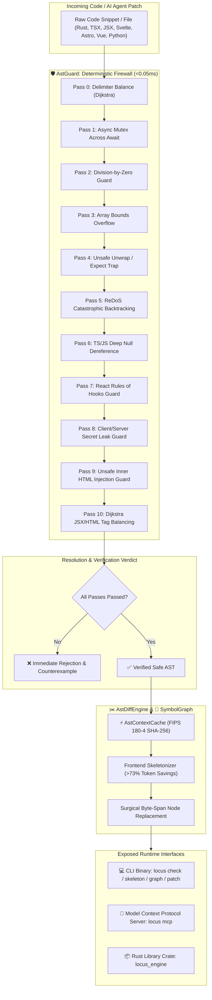
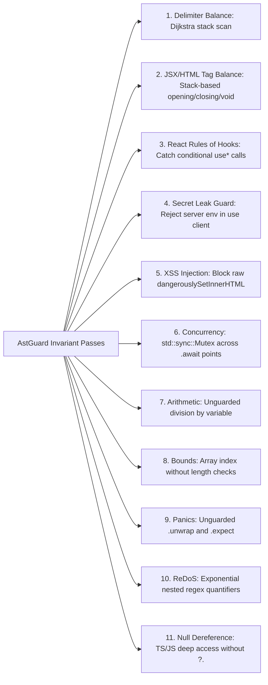

# locus-engine 🦀⚡

> **Deterministic AST Safety Guard, High-Throughput Compound Pipelines, Bidirectional Intent & Contract Synthesizer, Polyglot Cross-Module Graph, and Zero-Dependency Model Context Protocol (MCP) Server in Pure Safe Rust.**

[-blue.svg)](https://github.com/ahmadshady747-create/LOCUS/releases/tag/v1.0.0)
[](LICENSE)
[-brightgreen.svg)](Cargo.toml)
[](src/mcp.rs)
[-success.svg)](src/)
[-purple.svg)](src/mcp.rs)
[-orange.svg)](src/mcp.rs)
[](src/diff.rs)

---

## ⚡ Overview & Vision

Modern AI code generation agents (Claude Code, Cursor, Copilot, Antigravity, Devin) and automated developer pipelines face two systemic engineering bottlenecks:
1. **Probabilistic Syntax, Concurrency & Security Regressions:** AI agents frequently hallucinate unclosed delimiters, broken JSX/HTML tags, illegal conditional hook calls, server secret leaks in `"use client"` files, panic-inducing `.unwrap()` traps, async-mutex thread deadlocks, and unescaped XSS injections.
2. **Context Window Inflation, LLM Turn Latency & Blind Refactoring:** Multi-step micro-calls multiply LLM turn delays, feeding entire 2,000-line source files into prompts wastes up to **80% of token budgets**, and refactoring shared symbols without blast-radius analysis leads to catastrophic downstream breaking changes.

**`locus-engine` (v1.0.0 - Production General Availability)** bridges stochastic AI models and deterministic systems engineering through pure safe Rust in microsecond time:
- **⚡ High-Throughput Compound Pipelines (`prepare_context`, `verified_patch`):** Consolidates multi-step workflows into single-pass atomic MCP operations (**`250 µs`** context prep, **`1.51 ms`** verified atomic patch).
- **📜 Bidirectional Intent & Contract Synthesis (`synthesize_contract`, `verify_contract`):** Proactively projects developer intent into strict type contract scaffolding and verifies implementation fidelity in **`15.27 µs`**.
- **💥 Blast-Radius Impact Analyzer (`get_blast_radius`):** Computes downstream caller chains, affected file sets, and breaking change risk scores across 100+ modules in **`6.43 µs`**.
- **🔍 Cross-Module Symbol Resolver (`resolve_symbol`):** Resolves module import hierarchies, origin files, byte spans, signatures, and doc-comments in **`4.99 µs`**.
- **🎯 Intent-Driven Context Slicing (`extract_intent_slice`):** Isolates target symbols and their direct dependencies with **>73% context token savings** in **`95.42 µs`**.
- **🛡️ Deterministic 11-Pass AST Safety Firewall (`check_safety`):** Enforces 11 formal invariants in **`24.70 µs`**.
- **🏛️ Architectural Health Auditor (`detect_import_cycles`, `find_orphan_exports`):** Finds circular dependency loops (`A -> B -> C -> A`) and dead exports.

---

## 📊 Empirical Benchmarks & Performance Metrics

Benchmarked under optimized release profile (`opt-level = 3`, `lto = thin`, `codegen-units = 1`):

| Subsystem / Operation | Benchmark Cycles | Total Elapsed | Average Latency | Status |
| :--- | :---: | :---: | :---: | :---: |
| **⚡ Compound `prepare_context` Pipeline** | 500 runs | `125.224 ms` | **`250.45 µs`** (0.25 ms / compound pass) | **100% PASS** |
| **🛡️ Compound `verified_patch` Pipeline** | 200 atomic patches | `302.132 ms` | **`1.51 ms`** / atomic patch | **100% PASS** |
| **🔍 Cross-Module Symbol Resolution** | 1,000 lookups | `4.990 ms` | **`4.99 µs`** (0.005 ms / query) | **100% PASS** |
| **💥 Blast Radius Impact Analyzer (100 Modules)** | 500 calculations | `3.213 ms` | **`6.43 µs`** (0.006 ms / analysis) | **100% PASS** |
| **🔄 Circular Import Dependency Detector (50 Nodes)** | 200 checks | `25.689 ms` | **`128.44 µs`** (0.128 ms / cycle check) | **100% PASS** |
| **🛡️ AstGuard Invariant Verification (Core)** | 1,000 iterations | `24.704 ms` | **`24.70 µs`** (0.024 ms / check) | **100% PASS** |
| **📜 ContractSynthesizer (Intent Scaffolding)** | 1,000 synthesis cycles | `15.271 ms` | **`15.27 µs`** (0.015 ms / contract) | **100% PASS** |
| **🎨 Frontend AST Guard (JSX, Hooks, Secrets, XSS)** | 1,000 iterations | `36.189 ms` | **`36.19 µs`** (0.036 ms / check) | **100% PASS** |
| **🔄 Bidirectional Contract Verification** | 500 round-trips | `34.072 ms` | **`68.14 µs`** / verification | **100% PASS** |
| **🎯 ContextSlicer (Intent-Driven Slicing)** | 1,000 slicing cycles | `95.417 ms` | **`95.42 µs`** (0.095 ms / slice) | **100% PASS** |
| **🗜️ Frontend TSX Component Skeletonizer** | 500 cycles | `160.267 ms` | **`320.53 µs`** (73.4% Token Savings) | **100% PASS** |
| **⚡ AstContextCache (FIPS 180-4 SHA-256)** | 1,000 inserts/lookups | `32.382 ms` | **`32.38 µs`** / digest + LRU | **100% PASS** |
| **🔌 MCP Stdio JSON-RPC Dispatch** | 1,000 round-trips | `160.630 ms` | **`160.63 µs`** / dispatch | **100% PASS** |
| **✂️ AstDiffEngine (Patch & Skeleton)** | 500 cycles | `24.339 ms` | **`48.68 µs`** / operation | **100% PASS** |
| **🧠 SymbolGraph Polyglot Indexer** | 600 files (1,600 symbols) | `25.424 ms` | **`42.37 µs`** / file | **100% PASS** |

### 🔍 Industry Comparison Matrix

| Capability | **`locus-engine` (v0.3.0)** | Traditional Linters (ESLint, Clippy) | Cloud AI Guardrails |
| :--- | :---: | :---: | :---: |
| **Verification Latency** | **`12 µs – 0.05 ms` (Nanosecond-scale)** | 250 – 1,500 ms (Process Spawns) | 500 – 2,500 ms (Network Round-Trip) |
| **Frontend Ecosystem Support** | **Native TSX, JSX, Svelte, Astro, Vue** | Multiple plugins required | Cloud Regex / LLM Prompt |
| **Execution Architecture** | **In-Memory Pure Rust Kernel** | Node.js / Python Runtime | Remote HTTP Cloud API |
| **Context Token Savings** | **`> 70% - 85%` (AST Skeleton)** | 0% (Full Files) | 0% (Full Files) |
| **MCP Protocol Support** | **Built-In JSON-RPC 2.0 over Stdio** | Requires Custom Wrappers | Proprietary APIs |
| **Memory Safety** | **100% Safe Rust (0 Unsafe Blocks)** | Varies (C/C++/Node) | Undefined |
| **External Dependencies** | **Zero Crypto/Runtime Bloat** | Heavy `node_modules` / Python env | Cloud Connection & API Keys |
| **Deterministic Guarantee** | **100% Formal Invariant Rejection** | Heuristic Warnings | Probabilistic LLM Re-evaluation |

---

## 🏛️ System Architecture & Workflow Pipeline



---

## 🛡️ The 11 Deterministic Safety Invariants



1. **Delimiter Balance (Dijkstra Linear Stack Algorithm):** Byte-accurate scanner verifying balanced closures `{}` `[]` `()` while ignoring comments (`//`, `/* */`), raw strings (`r#"..."#`), template literals (`` `...` ``), and char literals (`'c'`).
2. **Dijkstra JSX & HTML Tag Balancing:** Verifies matching opening/closing tags, JSX fragments (`<>...</>`), and self-closing void elements (``, `<input />`, `<br />`, `<Component />`).
3. **React Rules of Hooks Guard:** Catches React hooks (`useState`, `useEffect`, `useMemo`, `useCallback`, `useContext`, `useRef`, custom `use*`) invoked inside `if` statements, ternary expressions, or loops.
4. **Client/Server Secret Leak Guard:** Flags un-prefixed server secrets (e.g. `process.env.DATABASE_URL`, `STRIPE_SECRET_KEY`) inside `"use client"` components.
5. **Unsafe Raw HTML Injection Guard:** Flags `dangerouslySetInnerHTML` without DOMPurify/sanitization wrappers.
6. **Async Mutex Concurrency Deadlock Guard:** Prevents holding `std::sync::Mutex` locks across `.await` points.
7. **Division-by-Zero Protection:** Proves the denominator is non-zero ($y \neq 0$) before permitting division.
8. **Array Bounds Protection:** Ensures array indexing (`arr[i]`) is preceded by length assertions or `.get()`.
9. **Unsafe Unwrap Guard:** Eliminates panic-inducing `.unwrap()` / `.expect()` calls lacking prior safety checks.
10. **ReDoS Catastrophic Backtracking Guard:** Identifies nested regex quantifiers causing $O(2^n)$ CPU freezing.
11. **Deep Property Null Dereference:** Catches multi-level object dereferences (`a.b.c.d`) without optional chaining (`?.`).

---

## 🔌 Model Context Protocol (MCP) Integration (12 Native Tools)

`locus-engine` exposes a native, zero-dependency JSON-RPC 2.0 stdio MCP server for **Claude Code**, **Cursor**, **Windsurf**, **VS Code**, and **Antigravity**.

### ⚙️ Configuration (`mcp_config.json` / `claude_desktop_config.json`)

```json
{
  "mcpServers": {
    "locus": {
      "command": "locus",
      "args": ["mcp"]
    }
  }
}
```

### 🛠️ Complete MCP Tools Reference (v1.0.0)

| MCP Tool Name | Category | Primary Function & Output |
| :--- | :---: | :--- |
| **`prepare_context`** | ⚡ **Compound** | Consolidates AST skeleton, intent context slice, blast radius, and resolved symbol in a single pass (**`<0.25ms`**). |
| **`verified_patch`** | 🛡️ **Compound** | Atomically validates pre-patch safety -> in-memory AST symbol replace -> validates full file -> writes to disk. |
| **`synthesize_contract`** | 📜 Contract | Projects developer intent into strict type scaffolding and invariant checklists before code generation. |
| **`verify_contract`** | 🔄 Verification | Proves generated code satisfies synthesized contracts with 0 invariant violations and signature fidelity. |
| **`get_blast_radius`** | 💥 Blast Radius | Traverses reverse dependencies to calculate downstream caller chains, affected files, and risk scores. |
| **`resolve_symbol`** | 🔍 Graph | Resolves symbol origin file, byte coordinates, type signatures, and doc-comments across module paths. |
| **`find_references`** | 📍 References | Locates all inbound call sites, imports, and usages of a symbol across the entire indexed workspace. |
| **`extract_intent_slice`** | 🎯 Slicing | Extracts a minimal AST context slice containing only the target symbol and direct dependencies. |
| **`check_safety`** | 🛡️ Safety | 11-pass deterministic safety verification (<0.05ms) returning exact byte-level counterexamples. |
| **`skeletonize`** | 🗜️ Compression | Extracts AST skeleton preserving signatures and imports with **`>73-85%`** token reduction. |
| **`patch_symbol`** | ✂️ Patching | Surgically replaces a named function, struct, component, or event handler without rewriting files. |
| **`index_graph`** | 🧠 Graph | Indexes directory into cross-file SymbolGraph and reports architectural health (cycles & orphan exports). |

---

## 🚀 Quick Install & CLI Reference

### Instant One-Line Installation

#### 🐧 Linux & 🍏 macOS:
```bash
curl -fsSL https://raw.githubusercontent.com/ahmadshady747-create/LOCUS/main/scripts/install.sh | bash
```

#### 🪟 Windows (PowerShell):
```powershell
irm https://raw.githubusercontent.com/ahmadshady747-create/LOCUS/main/scripts/install.ps1 | iex
```

---

### 💻 CLI Commands (9 Built-In Commands)

```bash
# 1. Deterministic Safety Verification (<0.05ms)
locus check src/models.rs

# 2. Proactive Intent Contract Synthesis
locus contract "user authentication session with jwt" --lang rust --target src/auth.rs

# 3. Context Slicing around Target Symbol
locus slice UserProfileCard src/components/UserProfileCard.tsx --depth 2

# 4. Context Skeleton Extraction (>73% Token Savings)
locus skeleton src/Dashboard.tsx

# 5. Index Workspace Graph & Audit Architectural Health (Cycles & Dead Exports)
locus graph src/

# 6. Analyze Blast-Radius Impact & Breaking Change Risk
locus impact AstGuard src/guard.rs --depth 3

# 7. Locate All Symbol References Across Project
locus refs AstGuard src/

# 8. Surgical Byte-Span AST Patching
locus patch src/models.rs --symbol User --with "pub struct User { pub id: u64 }"

# 9. Start MCP JSON-RPC 2.0 stdio Server
locus mcp
```

---

## 🛠️ Rust Library Integration

Add `locus-engine` to your `Cargo.toml`:

```toml
[dependencies]
locus-engine = "1.0.0"
```

```rust
use locus_engine::{
    AstGuard, AstDiffEngine, ContractSynthesizer, ContextSlicer, SymbolGraph, Language,
};

fn main() {
    // 1. Proactive Contract Synthesis (15µs)
    let contract = ContractSynthesizer::synthesize(
        "payment checkout session",
        Some("src/checkout.rs"),
        None,
        Language::Rust,
    );

    // 2. Instant Invariant Safety Verification (24µs)
    let code = "pub fn add(a: i32, b: i32) -> i32 { a + b }";
    let report = AstGuard::verify(code);
    assert!(report.passed);

    // 3. Surgical Context Compression (>73% Token Savings)
    let skeleton = AstDiffEngine::skeletonize(code, Language::Rust);
    println!("Compressed Skeleton:\n{}", skeleton);

    // 4. Cross-File Symbol Graph & Blast Radius Analysis
    let mut graph = SymbolGraph::new();
    graph.index_file_content("src/lib.rs", code, Language::Rust);
    let blast = graph.calculate_blast_radius("add", Some("src/lib.rs"), 2);
    println!("Blast Radius Risk: [{}]", blast.risk_score);
}
```

---

## 📂 Repository Anatomy

```text
d:\LOCUS\
├── Cargo.toml                  # Single-crate package manifest (v1.0.0 GA)
├── LICENSE                     # Business Source License 1.1 with explicit As-Is disclaimer
├── README.md                   # Comprehensive technical documentation & benchmarks
├── SPEC.md                     # Detailed formal specification of core algorithms
├── .gitattributes              # GitHub Linguist classification (100% Rust project)
├── scripts/
│   ├── install.sh              # One-line curl installer for Linux & macOS
│   └── install.ps1             # One-line PowerShell installer for Windows
├── tests/
│   └── benchmarks.rs           # 15 high-precision benchmark & stress test suites
└── src/
    ├── lib.rs                  # Public library crate re-exports
    ├── main.rs                 # CLI entrypoint (9 production commands)
    ├── types.rs                # Core data models, enums, AST nodes, and Language Display
    ├── guard.rs                # 11-pass deterministic AST safety invariant firewall
    ├── contract.rs             # Proactive Intent Contract Synthesizer & Verifier
    ├── slice.rs                # Intent-driven AST Context Slicer (>73% token reduction)
    ├── graph.rs                # Polyglot SymbolGraph, Path Resolver & Blast Radius Engine
    ├── diff.rs                 # Surgical byte-span AST patching and component skeletonizer
    ├── cache.rs                # Pure FIPS 180-4 SHA-256 LRU digest cache
    └── mcp.rs                  # 12-tool Model Context Protocol (MCP) JSON-RPC 2.0 server
```

---

## 📄 Licensing & Commercial Tiers

`locus-engine` is published under the [Business Source License 1.1 (BSL 1.1)](LICENSE):

| License Tier | Target Audience / Scope | Pricing |
| :--- | :--- | :---: |
| **Free Tier** | Individuals, students, open-source projects, and teams with **< 5 developers**. | **$0 (Free)** |
| **Internal Commercial Seat** | Internal usage & CI/CD within organizations with **5+ developers** *(Internal use only; no re-selling/SaaS)*. | **$150 USD / seat / year** |
| **Commercial SaaS & Cloud OEM** | Embedding, hosting, or offering locus-engine as a commercial SaaS, cloud API, or OEM product. | **$10,000 USD / year** |

> **Warranty & Support Disclaimer (As-Is / Self-Service):** The software is provided "AS IS" on a self-service basis without warranties of any kind. Dedicated technical support, custom SLA guarantees, and enterprise integration assistance are not included unless negotiated under a separate custom agreement.

For license activation and commercial contracts: Contact the author below or email `licensing@locus.dev`.

---

## 👤 Author & Direct Connect

Architected & built independently by **Ahmed Shadi** (Libya 🇱🇾).

- 📘 **Facebook:** [Ahmed Shadi Profile](https://www.facebook.com/share/1DZibmYSrx/)
- 🐙 **GitHub:** [@ahmadshady747-create](https://github.com/ahmadshady747-create)
- 📧 **Direct Inquiries:** Via GitHub Issues & Discussions
