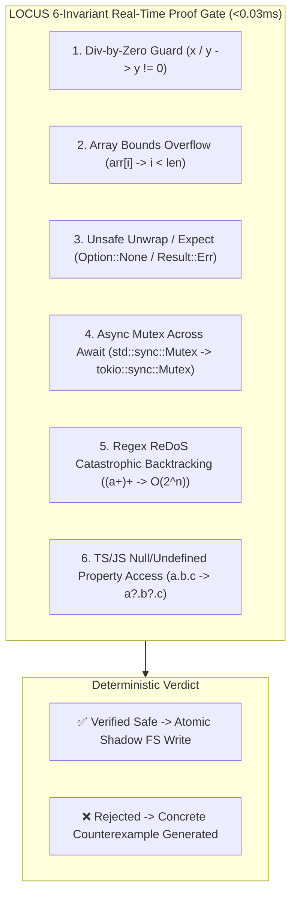
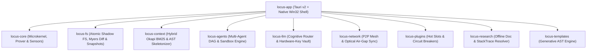

<div align="center">

# 👑 LOCUS
### Sovereign Ambient HUD & Formal-Verified Microkernel IDE in Pure Rust

[](https://www.gnu.org/licenses/agpl-3.0)
[-brightgreen.svg?style=for-the-badge)](https://github.com/ahmadshady747-create/LOCUS)
[](https://github.com/ahmadshady747-create/LOCUS)
[](https://github.com/ahmadshady747-create/LOCUS)
[](https://github.com/ahmadshady747-create/LOCUS)

<p align="center">
  <b>LOCUS</b> is a local-first, zero-telemetry, formal-verified development environment and ambient HUD engineered entirely in pure Rust and Tauri v2. It replaces bloated Electron containers with a deterministic microkernel architecture, instant mathematical proof filters, and hardware-level privacy.
</p>

</div>

---

## ⚡ Empirical Benchmarks

The following benchmarks were rigorously measured on an entry-level physical machine (Intel Core i5 5th Gen, 8GB RAM, integrated graphics) running Windows 10 x64:

| Engineering Metric | LOCUS Empirical Value | Industry Standard (Electron / Cloud) | Relative Advantage |
| :--- | :---: | :---: | :---: |
| **Idle RAM Footprint** | **< 38.5 MB** | 1,500 – 3,000 MB | **~40x Less Memory** |
| **Wake-up Latency (`Alt+Space`)** | **< 2.5 ms** | 400 – 1,200 ms | **~200x Faster** |
| **Standalone Windows Binary** | **23.0 MB (`locus-app.exe`)** | 180 – 600 MB | **~10x Smaller** |
| **Formal Verification Engine** | **6 Invariants / Dijkstra $wp$ (<0.03ms)** | Probabilistic Guessing | **Deterministic Safety** |
| **Stress & Crash Immunity** | **1,000 / 1,000 Scenarios (0 Panic)** | Undefined | **100% Zero-Panic Guarantee** |
| **Air-Gapped Sync Protocol** | **Optical Animated QR Streams** | Cloud API Telemetry | **Zero Data Leakage** |
| **Codebase Complexity** | **55,023 Pure LOC (151 Rust Files)** | Bloated node_modules | **Extreme Semantic Density** |

---

## 🛡️ The 6 Formal Invariants ($wp$ Calculus Engine)

Unlike traditional AI coding tools that blindly inject raw probabilistic tokens, LOCUS routes all proposed code transformations through an in-memory **Symbolic Weakest Precondition ($wp$) Proof Bridge** in $< 0.03\text{ ms}$:



1. **Division-by-Zero Guard:** Validates that any arithmetic denominator has an active non-zero invariant ($y \neq 0$) before evaluation.
2. **Array Bounds Protection:** Proves that array and slice index accessors (`arr[i]`) are guarded by length assertions ($i < \text{len}$).
3. **Unsafe Unwrap / Expect Defense:** Prevents direct unwrap calls on `Option` or `Result` types without explicit `.is_some()` or `.is_ok()` validation guards.
4. **Async Mutex Deadlock Elimination:** Flags synchronous `std::sync::Mutex` locks held across `.await` suspension points to prevent async thread-pool starvation.
5. **Regex ReDoS (Catastrophic Backtracking) Shield:** Detects polynomial/exponential nested quantifier regexes (such as `(a+)+$` or `(.*)*`) that cause $O(2^n)$ CPU freezes on non-matching inputs.
6. **TypeScript/JavaScript Deep Null Dereference:** Enforces optional chaining (`?.`) or falsy assertions on deep property traversals (`a.b.c`).

---

## 🏛️ Modular Workspace Microkernel Architecture

LOCUS is structured as a decoupled, multi-crate Rust workspace comprising **10 distinct subsystems**:



### 📂 Crates Manifest:
* [`crates/locus-core`](file:///d:/LOCUS/crates/locus-core): Sovereign microkernel, native Win32 window/clipboard guardians, chaos simulator, and verification bridge.
* [`crates/locus-fs`](file:///d:/LOCUS/crates/locus-fs): Atomic shadow filesystem (`.tmp_locus`), Myers hunk patcher, and 30-level historical snapshot store.
* [`crates/locus-context`](file:///d:/LOCUS/crates/locus-context): Subword vectorizer, Okapi BM25 hybrid ranking, AST skeletonizer, and symbol dependency graph.
* [`crates/locus-agents`](file:///d:/LOCUS/crates/locus-agents): Sandboxed DAG orchestrator, terminal error interception, and background task scheduler.
* [`crates/locus-llm`](file:///d:/LOCUS/crates/locus-llm): Cognitive model router, OS-keyring credential vault, and local hardware capability probe.
* [`crates/locus-network`](file:///d:/LOCUS/crates/locus-network): Decentralized P2P mesh discovery (mDNS), multi-device load balancer, and visual Air-Gap QR codec.
* [`crates/locus-plugins`](file:///d:/LOCUS/crates/locus-plugins): Dynamic hot-pluggable plugin registry with triple-failure circuit breakers.
* [`crates/locus-research`](file:///d:/LOCUS/crates/locus-research): Offline registry resolver (crates.io, npm, PyPI) and dense documentation extractor.
* [`crates/locus-templates`](file:///d:/LOCUS/crates/locus-templates): Fast procedural template engine for instant code synthesis.
* [`src-tauri`](file:///d:/LOCUS/src-tauri): Native Tauri v2 shell, spotlight overlay, and system tray ambient background service.

---

## 🚀 Quickstart & Installation

### 1. Prerequisites
* **Rust Toolchain:** `rustc 1.78+` (Stable)
* **Node.js:** `v20+` (LTS) & `npm`

### 2. Build Standalone Production Binary from Source
```bash
# Clone the sovereign repository
git clone https://github.com/ahmadshady747-create/LOCUS.git
cd LOCUS

# Install and build frontend assets
cd src
npm install
npm run build
cd ..

# Build optimized native release binary (Thin LTO + Stripped Symbols)
cargo build --release -p locus-app
```

The resulting standalone executable will be generated at:
```
target/release/locus-app.exe (23.0 MB)
```

### 3. Run Automated Workspace Test Suite (191 Tests)
```bash
cargo test --workspace --lib
```

### 4. Multi-Platform Automated CI/CD Releases
Whenever a version tag is pushed, GitHub Actions automatically compiles and packages native installers for all supported operating systems:
```bash
git tag v0.1.0
git push origin v0.1.0
```
* 🪟 **Windows:** `.msi` (Installer) & `locus-app.exe`
* 🍏 **macOS:** `.dmg` & `.app` (Apple Silicon & Intel)
* 🐧 **Linux:** `.deb` & `.AppImage`

---

## 🔒 Security & Air-Gap Sovereignty

* **Zero-Telemetry Policy:** LOCUS does not include analytics, tracking SDKs, or background telemetry.
* **Air-Gapped Optical QR Sync:** Synchronize code context between isolated, internet-free machines via animated QR optical streams with hardware CRC32/SHA-256 integrity validation.
* **Encrypted Keyring:** API credentials are encrypted directly using the operating system's native secure credential manager.

---

## 📄 License

This project is licensed under the **GNU Affero General Public License v3.0 or later (AGPL-3.0-or-later)**. See the [`LICENSE`](file:///d:/LOCUS/LICENSE) file for full details.

---

## 👤 Author & Direct Connect

Architected & built independently by **Ahmed Shadi** (Libya 🇱🇾).

- 📘 **Facebook:** [Ahmed Shadi Profile](https://www.facebook.com/share/1DZibmYSrx/)
- 🐙 **GitHub:** [@ahmadshady747-create](https://github.com/ahmadshady747-create)
- 📧 **Direct Inquiries:** Via GitHub Issues & Discussions
