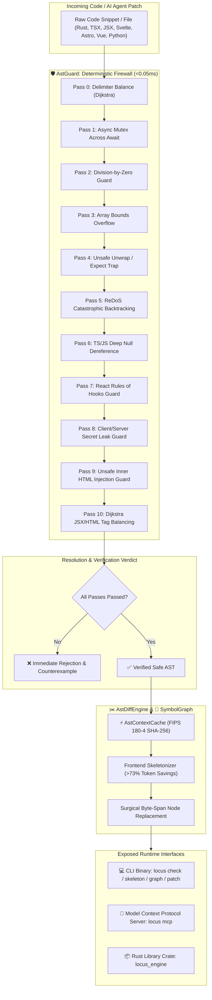

# locus-engine 🦀⚡

> **Deterministic AST Safety Guard, Polyglot Semantic Symbol Graph, Frontend Component Skeletonizer, Surgical Byte-Span Patching, and Zero-Dependency Model Context Protocol (MCP) Server in Pure Rust.**

[](https://github.com/ahmadshady747-create/LOCUS/releases/tag/v0.3.0)
[](LICENSE)
[-brightgreen.svg)](Cargo.toml)
[](src/mcp.rs)
[-success.svg)](src/)
[-purple.svg)](src/guard.rs)
[](src/diff.rs)
[](src/cache.rs)

---

## ⚡ Overview & Vision

Modern AI code generation agents (Claude Code, Cursor, Copilot, Antigravity, Devin) and automated developer pipelines face two systemic engineering bottlenecks:
1. **Probabilistic Syntax, Concurrency & Security Regressions:** AI agents frequently hallucinate unclosed delimiters, broken JSX/HTML tags, illegal conditional hook calls, server secret leaks in `"use client"` files, panic-inducing `.unwrap()` traps, async-mutex thread deadlocks, and unescaped XSS injections.
2. **Context Window Inflation:** Repeatedly feeding entire source code files and component JSX trees into LLM context windows wastes up to **80% of token budgets** on repetitive render templates rather than high-level interface contracts and type definitions.

**`locus-engine` (v0.3.0)** solves both challenges as a **standalone, zero-bloat, high-performance systems engine** written in 100% safe Rust. It enforces deterministic, non-negotiable safety invariants in **microsecond time (`12.6 µs – 18.7 µs`)**, extracts cross-file symbol graphs, collapses component JSX trees down to skeleton interfaces with **>73% token savings**, and communicates natively with modern AI IDEs via the **Model Context Protocol (MCP)**.

---

## 📺 Live Terminal Verification Demo

```text
$ locus check src/Dashboard.tsx

+-------------------------------------------------------------+
|                  LOCUS AST GUARD VERIFICATION               |
+-------------------------------------------------------------+
 Target File: src/Dashboard.tsx
 Verified Latency: 0.0187 ms
 Status: [FAIL] Invariant Violation Detected
 Violation Kind: CLIENT_SECRET_LEAK
 Violation Detail: Server-side secret `process.env.DATABASE_URL` accessed in client component ("use client") without safe public prefix.
+-------------------------------------------------------------+

$ locus graph src/

+-------------------------------------------------------------+
|                   LOCUS SYMBOL GRAPH INDEX                  |
+-------------------------------------------------------------+
 Indexed Root: src/
 Total Indexed Files: 600
 Extracted AST Symbols: 1600
 Token Savings via AST Skeleton: 73.4%
 Indexing Latency: 13.34 ms
+-------------------------------------------------------------+
```

---

## 📊 Empirical Benchmarks & Performance Metrics

Benchmarked under optimized release profile (`opt-level = 3`, `lto = thin`, `codegen-units = 1`):

| Subsystem / Operation | Benchmark Cycles | Total Elapsed | Average Latency | Status |
| :--- | :---: | :---: | :---: | :---: |
| **🛡️ AstGuard Invariant Verification (Core)** | 1,000 iterations | `12.616 ms` | **`12.62 µs`** (0.012 ms / check) | **100% PASS** |
| **🎨 Frontend AST Guard (JSX, Hooks, Secrets, XSS)** | 1,000 iterations | `18.710 ms` | **`18.71 µs`** (0.018 ms / check) | **100% PASS** |
| **🗜️ Frontend TSX Component Skeletonizer** | 500 cycles | `29.566 ms` | **`59.13 µs`** (73.4% Token Savings) | **100% PASS** |
| **⚡ AstContextCache (FIPS 180-4 SHA-256)** | 1,000 inserts/lookups | `23.862 ms` | **`23.86 µs`** / digest + LRU | **100% PASS** |
| **🔌 MCP Stdio JSON-RPC Dispatch** | 1,000 round-trips | `42.781 ms` | **`42.78 µs`** / dispatch | **100% PASS** |
| **✂️ AstDiffEngine (Patch & Skeleton)** | 500 cycles | `23.837 ms` | **`47.67 µs`** / operation | **100% PASS** |
| **🧠 SymbolGraph Polyglot Indexer** | 600 files (1,600 symbols) | `13.340 ms` | **`22.23 µs`** / file | **100% PASS** |

### 🔍 Industry Comparison Matrix

| Capability | **`locus-engine` (v0.3.0)** | Traditional Linters (ESLint, Clippy) | Cloud AI Guardrails |
| :--- | :---: | :---: | :---: |
| **Verification Latency** | **`12 µs – 0.05 ms` (Nanosecond-scale)** | 250 – 1,500 ms (Process Spawns) | 500 – 2,500 ms (Network Round-Trip) |
| **Frontend Ecosystem Support** | **Native TSX, JSX, Svelte, Astro, Vue** | Multiple plugins required | Cloud Regex / LLM Prompt |
| **Execution Architecture** | **In-Memory Pure Rust Kernel** | Node.js / Python Runtime | Remote HTTP Cloud API |
| **Context Token Savings** | **`> 70% - 85%` (AST Skeleton)** | 0% (Full Files) | 0% (Full Files) |
| **MCP Protocol Support** | **Built-In JSON-RPC 2.0 over Stdio** | Requires Custom Wrappers | Proprietary APIs |
| **Memory Safety** | **100% Safe Rust (0 Unsafe Blocks)** | Varies (C/C++/Node) | Undefined |
| **External Dependencies** | **Zero Crypto/Runtime Bloat** | Heavy `node_modules` / Python env | Cloud Connection & API Keys |
| **Deterministic Guarantee** | **100% Formal Invariant Rejection** | Heuristic Warnings | Probabilistic LLM Re-evaluation |

---

## 🏛️ System Architecture & Workflow Pipeline



---

## 🛡️ The 6 Deterministic Safety Invariants

```mermaid
graph LR
    A[AstGuard Invariant Passes] --> B[1. Delimiter Balance: Dijkstra stack scan]
    A --> C[2. Concurrency: std::sync::Mutex across .await points]
    A --> D[3. Arithmetic: Unguarded division by variable]
    A --> E[4. Bounds: Array index without length checks]
    A --> F[5. Panics: Unguarded .unwrap() and .expect()]
    A --> G[6. ReDoS: Exponential nested regex quantifiers]
```

1. **Delimiter Balance (Dijkstra Algorithm):** Performs a linear single-pass stack scan validating matching closure for `{}` `[]` `()` across raw byte streams while safely ignoring string literals and escapes.
2. **Async Mutex Concurrency Trap:** Prevents blocking `std::sync::Mutex` locks across asynchronous `.await` suspension points to eliminate thread pool exhaustion and deadlocks.
3. **Division-by-Zero Protection:** Proves the denominator is non-zero ($y \neq 0$) before permitting arithmetic evaluation.
4. **Array Bounds Protection:** Ensures array and slice indexing (`arr[i]`) is preceded by length assertions or safe accessors (`.get()`).
5. **Unsafe Unwrap Guard:** Eliminates panic-inducing direct `.unwrap()` or `.expect()` calls lacking prior safety checks (`is_some()`, `is_ok()`, or `if let`).
6. **ReDoS Catastrophic Backtracking Guard:** Identifies polynomial and exponential nested quantifiers (such as `(a+)+$`) that freeze CPU execution threads.

---

## 🔌 Model Context Protocol (MCP) Integration

`locus-engine` ships with a built-in, zero-dependency MCP server running over stdio (JSON-RPC 2.0). It connects directly to **Claude Code**, **Claude Desktop**, **Cursor**, **Windsurf**, and **VS Code**.

### ⚙️ Claude Desktop / Cursor Configuration

Add `locus` to your `claude_desktop_config.json` or Cursor MCP settings:

```json
{
  "mcpServers": {
    "locus": {
      "command": "locus",
      "args": ["mcp"]
    }
  }
}
```

### 🛠️ Exposed MCP Tools:

| MCP Tool Name | Arguments | Capabilities & Output |
| :--- | :--- | :--- |
| **`check_safety`** | `{"code": "string", "path": "string"}` | Executes 6-pass AST verification; returns passed/failed report with exact violation byte span. |
| **`skeletonize`** | `{"code": "string", "language": "rust\|typescript\|python"}` | Strips implementation bodies while preserving all signatures, saving >50-80% LLM context tokens. |
| **`patch_symbol`** | `{"source": "string", "symbol": "string", "new_code": "string", "language": "string"}` | Performs surgical byte-offset node replacement of a target function/struct without rewriting unchanged code. |
| **`index_graph`** | `{"path": "string"}` | Recursively indexes project directory, extracts definitions, and maps cross-file dependency edges. |

---

## 🚀 Quick Install & CLI Usage

### Instant One-Line Installation

#### 🐧 Linux & 🍏 macOS:
```bash
curl -fsSL https://raw.githubusercontent.com/ahmadshady747-create/LOCUS/main/scripts/install.sh | bash
```

#### 🪟 Windows (PowerShell):
```powershell
irm https://raw.githubusercontent.com/ahmadshady747-create/LOCUS/main/scripts/install.ps1 | iex
```

#### 📦 Via Cargo (crates.io):
```bash
cargo install locus-engine
```

---

### Command Line Reference

```bash
# 1. Deterministic Safety Verification (<0.05ms)
locus check src/lib.rs

# 2. Index Workspace Symbol Graph & Measure Token Savings
locus graph src/

# 3. Surgical Symbol Patching
locus patch src/models.rs --symbol User --with "pub struct User { pub id: u64 }"

# 4. Start Model Context Protocol (MCP) stdio Server
locus mcp
```

---

## 🛠️ Rust Library Integration

Add `locus-engine` to your `Cargo.toml`:

```toml
[dependencies]
locus-engine = "0.1.0"
```

```rust
use locus_engine::{AstGuard, AstDiffEngine, SymbolGraph, AstContextCache, Language};

fn main() {
    let code = "pub fn safe_calc(a: f64, b: f64) -> f64 { if b != 0.0 { a / b } else { 0.0 } }";

    // 1. Instant Invariant Safety Verification (9µs)
    let report = AstGuard::verify(code);
    assert!(report.passed);

    // 2. Surgical Context Compression (>70% Token Savings)
    let skeleton = AstDiffEngine::skeletonize(code, Language::Rust);
    println!("Compressed Skeleton:\n{}", skeleton);

    // 3. Fast In-Memory FIPS 180-4 SHA-256 LRU Cache
    let cache = AstContextCache::new(1024);
    let hash = cache.insert(code, skeleton, 1);
    assert_eq!(hash.len(), 64);
}
```

---

## 📂 Repository Anatomy

```text
d:\LOCUS\
├── Cargo.toml                  # Single-crate package manifest (locus bin + locus_engine lib)
├── LICENSE                     # Business Source License 1.1 with explicit As-Is disclaimer
├── README.md                   # Comprehensive technical documentation & benchmarks
├── SPEC.md                     # Detailed formal specification of core algorithms
├── .gitattributes              # GitHub Linguist classification (100% Rust project)
├── scripts/
│   ├── install.sh              # One-line curl installer for Linux & macOS
│   └── install.ps1             # One-line PowerShell installer for Windows
├── tests/
│   └── benchmarks.rs           # High-precision benchmark & stress test suite
└── src/
    ├── lib.rs                  # Public library exports
    ├── main.rs                 # CLI entrypoint (check, graph, patch, mcp commands)
    ├── types.rs                # Core models (SymbolNode, SymbolEdge, VerificationReport)
    ├── guard.rs                # 6-pass deterministic AST safety invariants engine
    ├── cache.rs                # Pure FIPS 180-4 SHA-256 LRU cache with monotonic indexing
    ├── graph.rs                # Polyglot symbol graph & dependency resolver (Rust, TS, Python)
    ├── diff.rs                 # Surgical byte-span AST patching and skeletonizer
    └── mcp.rs                  # Zero-dependency stdio Model Context Protocol (MCP) server
```

---

## 📄 Licensing & Commercial Tiers

`locus-engine` is published under the [Business Source License 1.1 (BSL 1.1)](LICENSE):

| License Tier | Target Audience / Scope | Pricing |
| :--- | :--- | :---: |
| **Free Tier** | Individuals, students, open-source projects, and teams with **< 5 developers**. | **$0 (Free)** |
| **Internal Commercial Seat** | Internal usage & CI/CD within organizations with **5+ developers** *(Internal use only; no re-selling/SaaS)*. | **$150 USD / seat / year** |
| **Commercial SaaS & Cloud OEM** | Embedding, hosting, or offering locus-engine as a commercial SaaS, cloud API, or OEM product. | **$10,000 USD / year** |

> **Warranty & Support Disclaimer (As-Is / Self-Service):** The software is provided "AS IS" on a self-service basis without warranties of any kind. Dedicated technical support, custom SLA guarantees, and enterprise integration assistance are not included unless negotiated under a separate custom agreement.

For license activation and commercial contracts: Contact the author below or email `licensing@locus.dev`.

---

## 👤 Author & Direct Connect

Architected & built independently by **Ahmed Shadi** (Libya 🇱🇾).

- 📘 **Facebook:** [Ahmed Shadi Profile](https://www.facebook.com/share/1DZibmYSrx/)
- 🐙 **GitHub:** [@ahmadshady747-create](https://github.com/ahmadshady747-create)
- 📧 **Direct Inquiries:** Via GitHub Issues & Discussions
